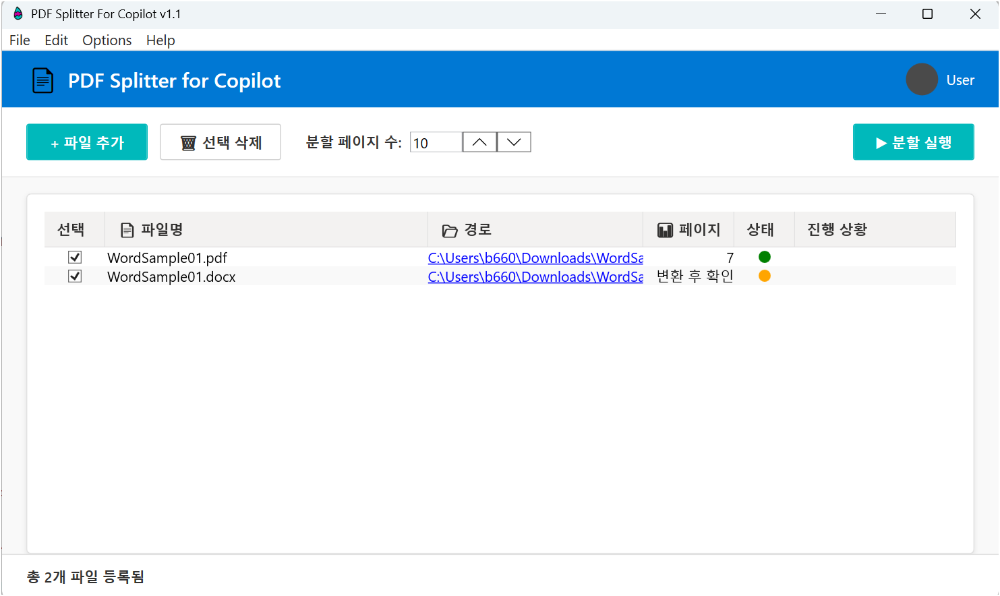

# PDF Splitter for Copilot

PDF 및 Word 파일을 지정된 페이지 단위로 분할하는 프로그램입니다. Copilot의 RAG 검색 정확성 향상을 위해 대용량 문서를 작은 단위로 분할할 수 있습니다.




## 🚀 주요 기능

- **PDF 분할**: 대용량 PDF 파일을 지정된 페이지 단위로 자동 분할
- **Word 변환**: Word 문서(.doc, .docx)를 PDF로 변환 후 분할 (Microsoft Office 불필요)
- **진행 상황 모니터링**: 실시간 처리 단계 및 진행률 표시
- **다중 파일 처리**: 여러 파일 동시 처리 지원
- **현대적 UI**: Fluent Design 기반 사용자 인터페이스

## 📋 시스템 요구사항

- **OS**: Windows 10/11
- **.NET**: .NET 8.0 Runtime
- **기타**: Syncfusion 라이선스 키 (선택사항)

## 🔑 Syncfusion 라이선스 설정

Word 파일을 PDF로 변환하는 기능은 Syncfusion 라이브러리를 사용합니다. 워터마크 없는 변환을 위해서는 라이선스 키가 필요합니다.

### 라이선스 키 획득 방법

#### 1. 무료 Community License (권장)
- **대상**: 개인 개발자, 소규모 회사 (연 매출 $1M 미만)
- **신청**: [Syncfusion Community License](https://www.syncfusion.com/products/communitylicense)
- **제한**: 개인/교육/소규모 상업적 용도

#### 2. 30일 무료 평가판
- **대상**: 평가 목적
- **신청**: [Syncfusion 평가판](https://www.syncfusion.com/downloads)

#### 3. 유료 라이선스
- **대상**: 대규모 상업적 용도
- **구매**: [Syncfusion 공식 웹사이트](https://www.syncfusion.com/sales/products)

### 라이선스 키 설정 방법

#### 방법 1: 개발자용 설정 파일 (권장)

**개발 환경에서 사용하는 방법:**

1. `license.config.example` 파일을 `license.config`로 복사:
   ```bash
   copy license.config.example license.config
   ```

2. `license.config` 파일을 열고 실제 라이선스 키로 교체:
   ```
   YOUR_ACTUAL_LICENSE_KEY_HERE
   ```

3. 빌드하면 자동으로 출력 디렉토리에 복사됨

**⚠️ 주의**: `license.config` 파일은 Git에 자동으로 제외됩니다.

#### 방법 2: 환경 변수 설정

**시스템 전체 또는 배포 환경에서 사용하는 방법:**

**Windows 환경 변수 설정:**
1. `Win + R` → `sysdm.cpl` 실행
2. **고급** 탭 → **환경 변수** 클릭
3. **시스템 변수** 또는 **사용자 변수**에 새로 만들기:
   - **변수 이름**: `SYNCFUSION_LICENSE_KEY`
   - **변수 값**: `귀하의_라이선스_키`

**PowerShell로 설정:**
```powershell
[Environment]::SetEnvironmentVariable("SYNCFUSION_LICENSE_KEY", "귀하의_라이선스_키", "User")
```

#### 방법 3: 실행 시 설정 파일

실행 파일과 같은 폴더에 `license.config` 파일을 생성하고 라이선스 키만 입력:

```
귀하의_라이선스_키
```

## 📦 설치 및 실행

### 개발자용 (소스 빌드)

```bash
git clone https://github.com/your-username/PDFSplitterforCopilot.git
cd PDFSplitterforCopilot
dotnet restore
dotnet build
dotnet run
```

### 일반 사용자용

1. [Releases](../../releases) 페이지에서 최신 버전 다운로드
2. 압축 해제 후 `PDFSplitterforCopilot.exe` 실행
3. 필요시 Syncfusion 라이선스 키 설정

## 🖥️ 사용 방법

1. **파일 추가**: 
   - 파일 추가 버튼 클릭 또는
   - PDF/Word 파일을 창에 드래그 앤 드롭

2. **분할 설정**: 
   - 분할할 페이지 수 입력 (기본값: 10페이지)

3. **파일 선택**: 
   - 처리할 파일 체크박스 선택

4. **분할 실행**: 
   - "분할 실행" 버튼 클릭
   - 진행 상황 실시간 확인

5. **결과 확인**: 
   - 원본 파일과 같은 폴더에 `output_split` 폴더 생성 (공통 폴더)
   - 분할된 PDF 파일들이 `파일명_page01-10.pdf`, `파일명_page11-20.pdf` 형태로 저장

## 🔧 기술 스택

- **.NET 8.0**: 메인 프레임워크
- **WPF**: 사용자 인터페이스
- **iText 7**: PDF 분할 처리
- **Syncfusion DocIO**: Word 문서 처리
- **ModernWpf**: 현대적 UI 컨트롤
- **Serilog**: 로깅
dotnet add package itext7.bouncy-castle-adapter --version 8.0.4
dotnet add package Microsoft.Office.Interop.Word --version 15.0.4797.1004
dotnet add package FluentWPF --version 0.10.2
dotnet add package ModernWpfUI --version 0.9.6
dotnet add package System.Drawing.Common --version 9.0.5
```

## 프로그램 실행 방법

### 방법 1: BAT 파일 사용 (권장)
프로젝트 폴더에서 다음 파일 중 하나를 실행:
- `run.bat` - 프로젝트 빌드 후 실행
- `publish.bat` - 최종 배포파일 생성을 위한 실행

### 방법 2: PowerShell 사용
```powershell
# 프로젝트 폴더로 이동
cd .\PDFSplitterforCopilot

# 또는 직접 실행 파일 호출
Invoke-Item ".\bin\Debug\net8.0-windows\PDFSplitterforCopilot.exe"
```

### 방법 3: Visual Studio Code 작업 사용
1. VS Code에서 프로젝트 열기
2. Ctrl+Shift+B 누르기 (빌드 작업 실행)
3. bin\Debug\net8.0-windows 폴더에서 PDFSplitterforCopilot.exe 실행

## 배포

```powershell
# 단일 실행파일로 배포
dotnet publish -c Release -r win-x64 --self-contained true -p:PublishSingleFile=true -p:PublishTrimmed=false -p:IncludeNativeLibrariesForSelfExtract=true 

## -p:PublishTrimmed=false 옵션을 유지하면 exe 실행파일이 정상적으로 실행되지 않는 경우를 발견, csproj 파일에 추가됨.

# 생성된 파일 위치: bin\Release\net8.0-windows\win-x64\publish\PDFSplitterforCopilot.exe
```