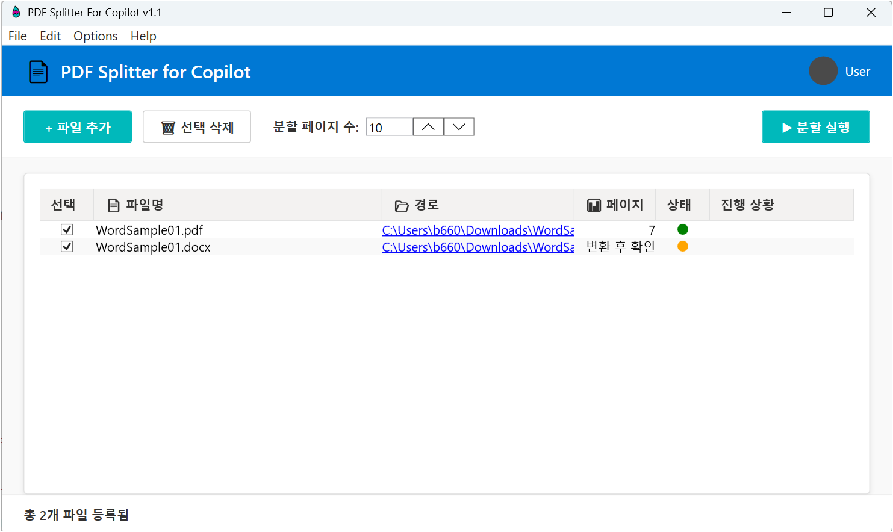

dotnet watch --project .\PDFSplitterforCopilot.csproj run


# PDF Splitter for Copilot

PDF 및 Word 파일을 지정된 페이지 단위로 분할하는 프로그램입니다. Copilot의 RAG 검색 정확성 향상을 위해 대용량 문서를 작은 단위로 분할할 수 있습니다.



## First-run commercial workflow

1. Start the app and choose a task from `Task`: `Split PDF`, `Convert Word`, or `Batch Convert Word`.
2. Add files with `Add files` or drag PDF/Word files into the window.
3. For normal splitting, use `Method = Fixed pages` and enter `Pages`.
4. For LLM-based splitting, use `Method = Context Split (LLM)`. The app asks for OpenAI API settings if no key is configured, then shows an editable preview before any PDF files are written.
5. For long-form documents, set `Overlap` to `1` or `2` in Context Split to duplicate boundary pages in adjacent output PDFs. The preview shows both semantic ranges and included ranges.
6. Use `Advanced export: RAG JSONL` only when JSONL chunks are needed for a downstream RAG index.
7. Click `Run`. During multi-file jobs, `Cancel` stops the workflow after the current file step finishes.
8. After completion, use the `Output` column to review generated files and open the output folder.

Operational notes:
- OpenAI settings are managed from `Options > OpenAI API Settings...`.
- User-saved OpenAI API keys are stored in the Windows user profile with current-user encryption.
- Split outputs are written under an `output_split` folder next to the source file.
- Context Split output files use short included-page names such as `sample_part02_p10-21.pdf`; semantic ranges are shown in the preview.
- Developer `.env` fallback remains supported for local development.


## 🚀 주요 기능

## ✅ Quality and CI

- Test guideline: `docs/code-test-guideline.md`
- Progress tracker: `docs/progress-tracker.md`
- Verification log: `docs/test-log.md`
- Lightweight CI: `.github/workflows/ci-lite.yml`
- Manual deploy pipeline: `.github/workflows/copy-deploy.yml`
- Manual EXE release pipeline: `.github/workflows/manual-release-single-file.yml`


- **PDF 분할**: 대용량 PDF 파일을 지정된 페이지 단위로 자동 분할
- **Word 변환**: Word 문서(.doc, .docx)를 PDF로 변환 후 분할 (Microsoft Office 불필요)
- **진행 상황 모니터링**: 실시간 처리 단계 및 진행률 표시
- **다중 파일 처리**: 여러 파일 동시 처리 지원
- **현대적 UI**: Fluent Design 기반 사용자 인터페이스

## 📋 시스템 요구사항

- **OS**: Windows 10/11
- **.NET**: .NET 8.0 Runtime
- **기타**: Syncfusion 라이선스 키 (선택사항)

## 🔑 Syncfusion 라이선스 설정

Word 파일을 PDF로 변환하는 기능은 Syncfusion 라이브러리를 사용합니다. 워터마크 없는 변환을 위해서는 라이선스 키가 필요합니다.

### 라이선스 키 획득 방법

#### 1. 무료 Community License (권장)
- **대상**: 개인 개발자, 소규모 회사 (연 매출 $1M 미만)
- **신청**: [Syncfusion Community License](https://www.syncfusion.com/products/communitylicense)
- **제한**: 개인/교육/소규모 상업적 용도

#### 2. 30일 무료 평가판
- **대상**: 평가 목적
- **신청**: [Syncfusion 평가판](https://www.syncfusion.com/downloads)

#### 3. 유료 라이선스
- **대상**: 대규모 상업적 용도
- **구매**: [Syncfusion 공식 웹사이트](https://www.syncfusion.com/sales/products)

### 라이선스 키 설정 방법

#### 방법 1: 개발자용 설정 파일 (권장)

**개발 환경에서 사용하는 방법:**

1. `license.config.example` 파일을 `license.config`로 복사:
   ```bash
   copy license.config.example license.config
   ```

2. `license.config` 파일을 열고 실제 라이선스 키로 교체:
   ```
   YOUR_ACTUAL_LICENSE_KEY_HERE
   ```

3. 빌드하면 자동으로 출력 디렉토리에 복사됨

**⚠️ 주의**: `license.config` 파일은 Git에 자동으로 제외됩니다.

#### 방법 2: 환경 변수 설정

**시스템 전체 또는 배포 환경에서 사용하는 방법:**

**Windows 환경 변수 설정:**
1. `Win + R` → `sysdm.cpl` 실행
2. **고급** 탭 → **환경 변수** 클릭
3. **시스템 변수** 또는 **사용자 변수**에 새로 만들기:
   - **변수 이름**: `SYNCFUSION_LICENSE_KEY`
   - **변수 값**: `귀하의_라이선스_키`

**PowerShell로 설정:**
```powershell
[Environment]::SetEnvironmentVariable("SYNCFUSION_LICENSE_KEY", "귀하의_라이선스_키", "User")
```

#### 방법 3: 실행 시 설정 파일

실행 파일과 같은 폴더에 `license.config` 파일을 생성하고 라이선스 키만 입력:

```
귀하의_라이선스_키
```

## 📦 설치 및 실행

### 개발자용 (소스 빌드)

```bash
git clone https://github.com/your-username/PDFSplitterforCopilot.git
cd PDFSplitterforCopilot
dotnet restore
dotnet build
dotnet run
```

### 일반 사용자용

1. [Releases](../../releases) 페이지에서 최신 버전 다운로드
2. 압축 해제 후 `PDFSplitterforCopilot.exe` 실행
3. 필요시 Syncfusion 라이선스 키 설정

## 🖥️ 사용 방법

1. **파일 추가**: 
   - 파일 추가 버튼 클릭 또는
   - PDF/Word 파일을 창에 드래그 앤 드롭

2. **분할 설정**: 
   - 분할할 페이지 수 입력 (기본값: 10페이지)

3. **파일 선택**: 
   - 처리할 파일 체크박스 선택

4. **분할 실행**: 
   - "분할 실행" 버튼 클릭
   - 진행 상황 실시간 확인

5. **결과 확인**: 
   - 원본 파일과 같은 폴더에 `output_split` 폴더 생성 (공통 폴더)
   - 분할된 PDF 파일들이 `파일명_page01-10.pdf`, `파일명_page11-20.pdf` 형태로 저장

## 🔧 기술 스택

- **.NET 8.0**: 메인 프레임워크
- **WPF**: 사용자 인터페이스
- **iText 7**: PDF 분할 처리
- **Syncfusion DocIO**: Word 문서 처리
- **ModernWpf**: 현대적 UI 컨트롤
- **Serilog**: 로깅
dotnet add package itext7.bouncy-castle-adapter --version 8.0.4
dotnet add package Microsoft.Office.Interop.Word --version 15.0.4797.1004
dotnet add package FluentWPF --version 0.10.2
dotnet add package ModernWpfUI --version 0.9.6
dotnet add package System.Drawing.Common --version 9.0.5
```

## 프로그램 실행 방법

### 방법 1: BAT 파일 사용 (권장)
프로젝트 폴더에서 다음 파일 중 하나를 실행:
- `publish.bat` - 최종 배포파일 생성을 위한 실행

### 방법 2: PowerShell 사용
```powershell
# 프로젝트 폴더로 이동
cd .\PDFSplitterforCopilot

# 또는 직접 실행 파일 호출
Invoke-Item ".\bin\Debug\net9.0-windows\PDFSplitterforCopilot.exe"
```

### 방법 3: Visual Studio Code 작업 사용
1. VS Code에서 프로젝트 열기
2. Ctrl+Shift+B 누르기 (빌드 작업 실행)
3. bin\Debug\net9.0-windows 폴더에서 PDFSplitterforCopilot.exe 실행

## 배포

```powershell
# 단일 실행파일로 배포
dotnet publish -c Release -r win-x64 --self-contained true -p:PublishSingleFile=true -p:PublishTrimmed=false -p:IncludeNativeLibrariesForSelfExtract=true 

## -p:PublishTrimmed=false 옵션을 유지하면 exe 실행파일이 정상적으로 실행되지 않는 경우를 발견, csproj 파일에 추가됨.

# 생성된 파일 위치: bin\Release\net9.0-windows\win-x64\publish\PDFSplitterforCopilot.exe
```
## Processing mode guide (Fast Split / RAG JSONL)

Fast Split remains the default workflow. By default, the app only splits PDF/Word files into page-based PDF outputs and does not run embedding, LLM calls, or RAG chunk export.

### 1) Fast Split (default)
- Runs only the existing page-based PDF/Word split behavior.
- Does not generate embeddings or call an LLM.
- Keeps latency and operating cost low.

### 2) RAG JSONL export (optional)
- Enable the `RAG JSONL` checkbox to generate `{filename}_rag_chunks.jsonl` in `output_split`.
- The JSONL export contains parent and child chunks, source page ranges, section path hints, retrieval policy hints, source file hash, chunk hash, and chunk policy version.
- The export is intended for a downstream Smart RAG pipeline. Embedding generation, background queues, hybrid search, and reranking are not performed by the desktop splitter.

### Operational notes
- JSONL regeneration is skipped when `source_file_sha256`, `export_page_start`, `export_page_end`, and `chunk_policy_version` match the existing export.
- Downstream indexing should use `chunk_hash` and `chunk_policy_version` to avoid duplicate embedding work.

## Context Split (LLM)

`Context Split (LLM)` keeps the existing page-copying split engine, but asks OpenAI to propose semantic page ranges before files are created.

### Setup

For regular app use, open `Options > OpenAI API Settings...` and save your OpenAI API key. The app stores it in the current Windows user profile at:

```text
%AppData%\PDFSplitterforCopilot\openai-settings.json
```

The API key is encrypted with the current Windows user scope. The model value is stored as plain text and defaults to `gpt-4o-mini`.

For development, you can still set an OpenAI API key outside the repository:

```powershell
$env:OPENAI_API_KEY = "your_api_key"
```

Optionally choose a model:

```powershell
$env:OPENAI_CONTEXT_SPLIT_MODEL = "gpt-4o-mini"
```

You can also put these values in a local `.env` file in the project folder. `.env` is ignored by git and is used as a fallback after environment variables and saved app settings:

```text
OPENAI_API_KEY=your_api_key
OPENAI_CONTEXT_SPLIT_MODEL=gpt-4o-mini
```

### Usage

1. Add a PDF or Word file.
2. Choose `Split PDF` from `Operation`.
3. Choose `Context Split (LLM)` from `Method`.
4. Enter the target number of pages per part.
5. Click `Run context split`.
6. Review the preview table (`part`, `title`, `page range`, `reason`, `confidence`).
7. Confirm to create context-named PDFs in `output_split`, or cancel to write nothing.

If no API key is configured, the app opens `OpenAI API Settings` automatically before requesting a context split.

`Fixed pages` remains the default and does not require OpenAI.
